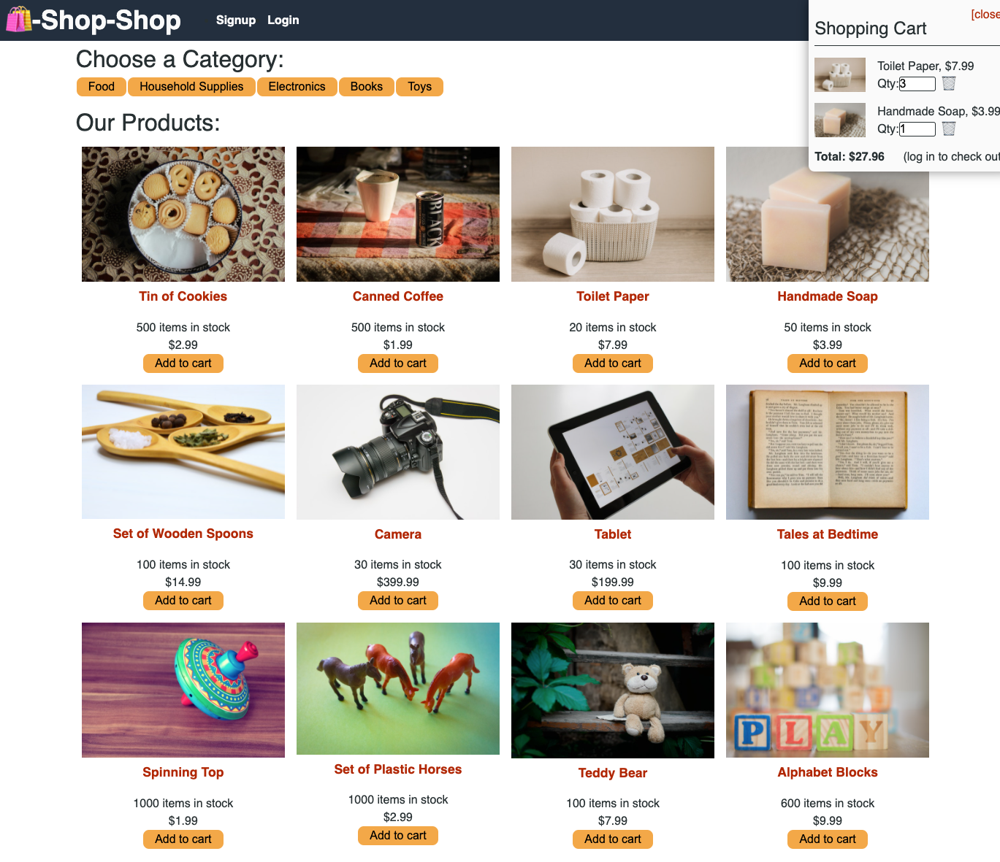

# Shop-Shop

This MERN-stack application allows the user to view items from the shop, add items from the shop to their cart and redirects checkout a stripe test portal.

This application has not been deployed but can be run from the development envrionment locally once it has been installed.

The following tools & packages were used for development:

- Client:
  - Apollo Server
  - React
  - React-Router
  - GraphQL
- Server:
  - Apollo Server
  - bcrypt
  - Express
  - GraphQL
  - jsonwebtoken
  - Mongoose
  - Stripe

## Application Functionality

The application is able to perform the following functions:

- Create user accounts
- Authenticate and allow existing users to log into their accounts
- Allow users (logged-in or not) to:
  - browse products in the catalog
  - Filter catalog items by category
  - View detailed pages for each catalog item including more detail
  - Add and remove items to/from their cart
- Allow logged-in users to checkout the items in their cart and redirect to a stripe test portal

## Screenshot

Here is a screenshot of the deployed application, with the cart expanded!

## Installation

To use this application, you will need to have Node.js and MongoDB installed and configured.

To install the application:

1. Fork the repository.
2. Execute `npm intall` in the command line for the root directory.
3. Execute `npm run install` in the command line for the root directory.

## Usage

To use this application, run `npm run develop` in the root directory, then the application will be running in the developmetn environment at http://localhost:3000.

## References

- apollo-server-express: https://www.npmjs.com/package/apollo-server-express
- Apollo: https://www.apollographql.com/docs/
- bcrypt: https://www.npmjs.com/package/bcrypt
- Bootstrap: https://getbootstrap.com/
- Express: https://expressjs.com/
- GraphQL: https://graphql.org/
- jsonwebtoken: https://www.npmjs.com/package/jsonwebtoken
- mongoose: https://mongoosejs.com/
- Stripe: https://stripe.com/en-ca
